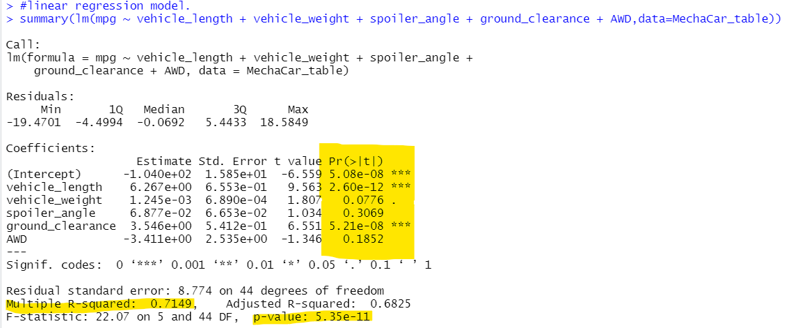
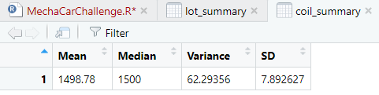
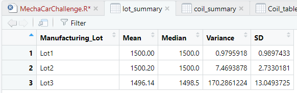
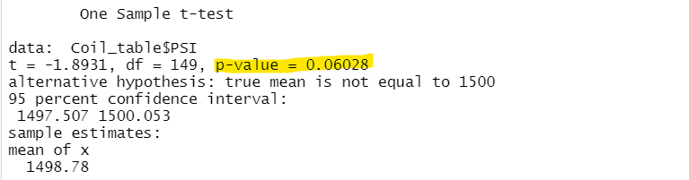
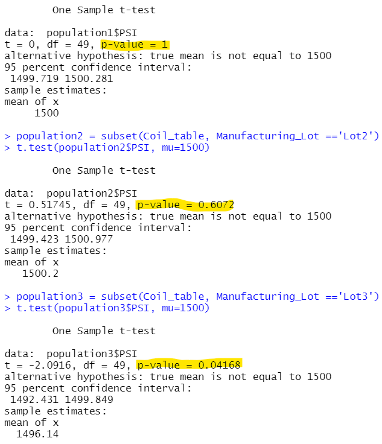

# MechaCar Statistical Analysis
## Project Overview
This project provides incite to the production of AutosRUSs' newest prototype, MechaCar. This project utlizes AutosRUSs' production data.

The tasks completed in this project include the following:

- Perform multiple linear regression analysis to identify which variables in the dataset predict the mpg of MechaCar prototypes
- Collect summary statistics on the pounds per square inch (PSI) of the suspension coils from the manufacturing lots
- Run t-tests to determine if the manufacturing lots are statistically different from the mean population
- Design a statistical study to compare vehicle performance of the MechaCar vehicles against vehicles from other manufacturers. For each statistical analysis, you’ll write a summary interpretation of the findings.

Resources:
RStudio, library: tidyverse/dplyr
## Results
### Linear Regression to Predict MPG

- The vaiables/coefficients vehicle_ length and ground_clearance (as well as intercept) are statistically unlikely to provide random amounts of variance to the linear model. In other words the vehicle_ length and ground_clearance have a significant impact on mpg. 
- Comparing the p-values of vehicle_length, ground_clearance, and intercept with significant level 0.05% specification provides sufficient evidence to reject our null hypothesis (slope of the linear model is zero).
- This linear model can be used to predict future observations. The linear regression function calculated an r-squared value of 0.71 which is close to 1 and a p-value under O.O5%. See below image

### Summary Statistics on Suspension Coils

- In total, for all manufacturing lots, the variance value is 62.29 which does not exceed 100 pounds per square inch. All manufacturing lots meet design specification. (seen below).

- However, individually each manufacturing lot does not meet design specification due to Lot3 exceeding 100 pounds per square inch (variance of 170.29, seen below).

### T-Tests on Suspension Coils

- Comparing all manufacturing lots to population mean of 1500 pounds per square inch, all lots together provided a p-value of about 0.06 which is above 0.05% level of significance. There is insufficient evidence to reject the null hypothesis, in other words, there is no significant difference between all the lots and the population mean (see image below).

- Comparing the each lot individually to the population mean (1500 pounds per square inch), there is some significant difference:
    - Lot3 indicate that since the p-value is 0.042 and it is less than the significant level.There is sufficient evidence to reject the null hypothesis and state that the Lot3 is statistically different than the population mean (see image below).
    - Lot1 p-value of 1 and Lot2 p-value of 0.6, are above our significance level. Therefore, there is no sufficient evidence to reject the null hypothesis, and that that Lot1 and Lot2 are statistically similar to the population mean (See image below).

## Study Design: MechaCar vs Competition

### Metrices to Test
- Cost (MSRP)
- Fuel Economy (MPG for City and Highway)
- Horse power (number of cylinders)
- Maintenance Costs
- Safety Ratings

### Null Hypothesis & Alternative Hypothesis
- H0: The means of all groups are equal, there is no sigificant difference between the groups.

- Ha: At least one of the means is different from all other groups, there is a significant difference between the groups.
### Preferred Statisical Test
- The most straightforward way to test the hypothesis is to use the analysis of variance (ANOVA) test, which is used to compare the means of a continuous numerical variable across a number of sample groups. This test would also a good starting point test to get a sense of possible differences in groups and allow for further tests (i.e, t-tests) to narrow the down the variables(factors) that are significantly different between the groups.
### Running the Statistical Test
- The data needed to run the statisitcal follows below criteria: 

    1. The dependent variable is numerical and continuous, and the independent variables are categorical.

    2. The dependent variable is considered to be normally distributed.

    3. The variance among each group should be very similar.

- As long as our input data satisfies the above criteria, we can use the ANOVA to test for the similarities or differences in our sample groups. 